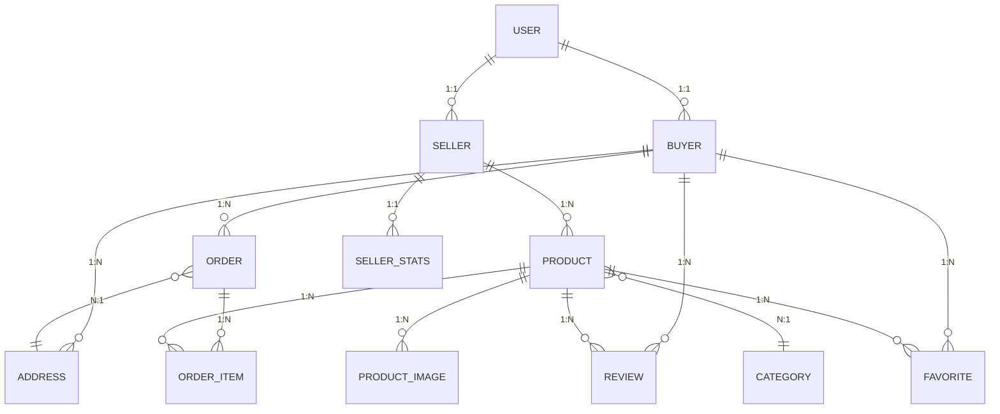

# Foodee Database Schema

Tài liệu về cấu trúc cơ sở dữ liệu PostgreSQL cho ứng dụng Foodee.

## 🗄 Database Overview

- **Database Engine**: PostgreSQL 13+
- **ORM**: TypeORM
- **Migration**: Auto-sync trong development
- **Connection Pool**: Default TypeORM pooling

## 📊 Entity Relationship Diagram



## 🔑 Core Entities

### User Entity
Lưu trữ thông tin cơ bản của người dùng.

```typescript
@Entity()
export class User {
  @PrimaryGeneratedColumn()
  id: number;

  @Column({ length: 100 })
  name: string;

  @Column({ unique: true, length: 50 })
  username: string;

  @Column({ unique: true, length: 255 })
  email: string;

  @Column()
  password: string; // bcrypt hashed

  @Column({
    type: 'enum',
    enum: UserRole,
    default: UserRole.BUYER
  })
  role: UserRole;

  @Column({ nullable: true, length: 500 })
  avatar?: string;

  @CreateDateColumn()
  createdAt: Date;

  @UpdateDateColumn()
  updatedAt: Date;

  // Relations
  @OneToOne(() => Buyer, buyer => buyer.user)
  buyer?: Buyer;

  @OneToOne(() => Seller, seller => seller.user)
  seller?: Seller;
}
```

**Constraints:**
- `username`: UNIQUE, NOT NULL
- `email`: UNIQUE, NOT NULL
- `password`: NOT NULL (hashed with bcrypt)

### Buyer Entity
Thông tin bổ sung cho người mua hàng.

```typescript
@Entity()
export class Buyer {
  @PrimaryGeneratedColumn()
  id: number;

  @Column()
  userId: number;

  @OneToOne(() => User, user => user.buyer)
  @JoinColumn({ name: 'userId' })
  user: User;

  @CreateDateColumn()
  createdAt: Date;

  @UpdateDateColumn()
  updatedAt: Date;

  // Relations
  @OneToMany(() => Order, order => order.buyer)
  orders: Order[];

  @OneToMany(() => Review, review => review.buyer)
  reviews: Review[];

  @OneToMany(() => Favorite, favorite => favorite.buyer)
  favorites: Favorite[];

  @OneToMany(() => Address, address => address.buyer)
  addresses: Address[];
}
```

### Seller Entity
Thông tin bổ sung cho người bán hàng.

```typescript
@Entity()
export class Seller {
  @PrimaryGeneratedColumn()
  id: number;

  @Column()
  userId: number;

  @Column({ nullable: true, length: 255 })
  shopName?: string;

  @Column({ nullable: true, length: 500 })
  shopAddress?: string;

  @Column({ nullable: true, length: 20 })
  shopPhone?: string;

  @Column({ nullable: true, type: 'text' })
  description?: string;

  @OneToOne(() => User, user => user.seller)
  @JoinColumn({ name: 'userId' })
  user: User;

  @CreateDateColumn()
  createdAt: Date;

  @UpdateDateColumn()
  updatedAt: Date;

  // Relations
  @OneToMany(() => Product, product => product.seller)
  products: Product[];

  @OneToOne(() => SellerStats, stats => stats.seller)
  stats?: SellerStats;
}
```

### Product Entity
Thông tin sản phẩm.

```typescript
@Entity()
@Index(['sellerId'])
@Index(['categoryId'])
@Index(['isAvailable'])
export class Product {
  @PrimaryGeneratedColumn()
  id: number;

  @Column()
  sellerId: number;

  @Column()
  categoryId: number;

  @Column({ length: 255 })
  name: string;

  @Column({ nullable: true, type: 'text' })
  description?: string;

  @Column({ type: 'decimal', precision: 10, scale: 2 })
  price: number;

  @Column({ default: 0 })
  stock: number;

  @Column({ default: true })
  isAvailable: boolean;

  @Column({ nullable: true, length: 255 })
  slug?: string;

  @Column({ type: 'decimal', precision: 3, scale: 1, default: 0 })
  discount: number; // Percentage

  @Column({ nullable: true, type: 'text' })
  tags?: string; // JSON string

  // Cached statistics for performance
  @Column({ type: 'decimal', precision: 3, scale: 2, default: 0 })
  averageRating: number;

  @Column({ default: 0 })
  totalReviews: number;

  @Column({ default: 0 })
  totalSold: number;

  @Column({ default: 0 })
  viewCount: number;

  @CreateDateColumn()
  createdAt: Date;

  @UpdateDateColumn()
  updatedAt: Date;

  // Relations
  @ManyToOne(() => Seller, seller => seller.products)
  @JoinColumn({ name: 'sellerId' })
  seller: Seller;

  @ManyToOne(() => Category, category => category.products)
  @JoinColumn({ name: 'categoryId' })
  category: Category;

  @OneToMany(() => ProductImage, image => image.product)
  images: ProductImage[];

  @OneToMany(() => Review, review => review.product)
  reviews: Review[];

  @OneToMany(() => OrderItem, orderItem => orderItem.product)
  orderItems: OrderItem[];

  @OneToMany(() => Favorite, favorite => favorite.product)
  favorites: Favorite[];
}
```

**Indexes:**
- `sellerId` - Để tìm sản phẩm của seller
- `categoryId` - Để filter theo danh mục
- `isAvailable` - Để lọc sản phẩm còn bán
- `createdAt` - Để sắp xếp theo thời gian

### ProductImage Entity
Hình ảnh của sản phẩm.

```typescript
@Entity()
@Index(['productId'])
@Index(['isPrimary'])
export class ProductImage {
  @PrimaryGeneratedColumn()
  id: number;

  @Column()
  productId: number;

  @Column({ type: 'text' })
  imageUrl: string; // Base64 data hoặc URL

  @Column({ type: 'varchar', length: 500, nullable: true })
  thumbnailUrl?: string;

  @Column({ type: 'varchar', length: 100 })
  mimeType: string; // image/jpeg, image/png, etc.

  @Column({ type: 'varchar', length: 255, nullable: true })
  originalName?: string;

  @Column({ type: 'int' })
  fileSize: number;

  @Column({ type: 'varchar', length: 255, nullable: true })
  altText?: string;

  @Column({ type: 'int', default: 0 })
  displayOrder: number;

  @Column({ type: 'boolean', default: false })
  isPrimary: boolean;

  @Column({ type: 'int', nullable: true })
  width?: number;

  @Column({ type: 'int', nullable: true })
  height?: number;

  @CreateDateColumn()
  createdAt: Date;

  @UpdateDateColumn()
  updatedAt: Date;

  @ManyToOne(() => Product, product => product.images, { onDelete: 'CASCADE' })
  @JoinColumn({ name: 'productId' })
  product: Product;
}
```

### Category Entity
Danh mục sản phẩm.

```typescript
@Entity()
export class Category {
  @PrimaryGeneratedColumn()
  id: number;

  @Column({ length: 100 })
  name: string;

  @Column({ nullable: true, length: 500 })
  description?: string;

  @Column({ nullable: true, length: 255 })
  slug?: string;

  @Column({ nullable: true, length: 500 })
  imageUrl?: string;

  @Column({ default: true })
  isActive: boolean;

  @Column({ default: 0 })
  sortOrder: number;

  @CreateDateColumn()
  createdAt: Date;

  @UpdateDateColumn()
  updatedAt: Date;

  // Relations
  @OneToMany(() => Product, product => product.category)
  products: Product[];
}
```

### Order Entity
Đơn hàng của khách hàng.

```typescript
@Entity()
@Index(['buyerId'])
@Index(['status'])
@Index(['createdAt'])
export class Order {
  @PrimaryGeneratedColumn()
  id: number;

  @Column()
  buyerId: number;

  @Column({ nullable: true })
  addressId?: number;

  @Column({ type: 'decimal', precision: 10, scale: 2 })
  totalPrice: number;

  @Column({
    type: 'enum',
    enum: OrderStatus,
    default: OrderStatus.PENDING
  })
  status: OrderStatus;

  @Column({ nullable: true, type: 'text' })
  note?: string;

  @Column({ nullable: true, length: 255 })
  paymentRef?: string; // VNPay transaction reference

  @Column({ nullable: true })
  paidAt?: Date;

  @Column({ nullable: true })
  shippedAt?: Date;

  @Column({ nullable: true })
  deliveredAt?: Date;

  @CreateDateColumn()
  createdAt: Date;

  @UpdateDateColumn()
  updatedAt: Date;

  // Relations
  @ManyToOne(() => Buyer, buyer => buyer.orders)
  @JoinColumn({ name: 'buyerId' })
  buyer: Buyer;

  @ManyToOne(() => Address, address => address.orders)
  @JoinColumn({ name: 'addressId' })
  address?: Address;

  @OneToMany(() => OrderItem, orderItem => orderItem.order)
  items: OrderItem[];
}
```

**OrderStatus Enum:**
```typescript
export enum OrderStatus {
  PENDING = 'pending',
  PAID = 'paid',
  CONFIRMED = 'confirmed',
  PREPARING = 'preparing',
  SHIPPING = 'shipping',
  DELIVERED = 'delivered',
  CANCELLED = 'cancelled',
  REFUNDED = 'refunded'
}
```

### OrderItem Entity
Chi tiết sản phẩm trong đơn hàng.

```typescript
@Entity()
@Index(['orderId'])
@Index(['productId'])
export class OrderItem {
  @PrimaryGeneratedColumn()
  id: number;

  @Column()
  orderId: number;

  @Column()
  productId: number;

  @Column()
  quantity: number;

  @Column({ type: 'decimal', precision: 10, scale: 2 })
  price: number; // Giá tại thời điểm đặt hàng

  @CreateDateColumn()
  createdAt: Date;

  @UpdateDateColumn()
  updatedAt: Date;

  // Relations
  @ManyToOne(() => Order, order => order.items, { onDelete: 'CASCADE' })
  @JoinColumn({ name: 'orderId' })
  order: Order;

  @ManyToOne(() => Product, product => product.orderItems)
  @JoinColumn({ name: 'productId' })
  product: Product;
}
```

### Review Entity
Đánh giá sản phẩm của khách hàng.

```typescript
@Entity()
@Index(['productId'])
@Index(['buyerId'])
export class Review {
  @PrimaryGeneratedColumn()
  id: number;

  @Column()
  userId: number;

  @Column()
  buyerId: number;

  @Column()
  productId: number;

  @Column({ type: 'int', width: 1 })
  rating: number; // 1-5 stars

  @Column({ nullable: true, type: 'text' })
  comment?: string;

  @Column({ default: true })
  isVisible: boolean;

  @CreateDateColumn()
  createdAt: Date;

  @UpdateDateColumn()
  updatedAt: Date;

  // Relations
  @ManyToOne(() => User, { eager: true })
  @JoinColumn({ name: 'userId' })
  user: User;

  @ManyToOne(() => Buyer, buyer => buyer.reviews)
  @JoinColumn({ name: 'buyerId' })
  buyer: Buyer;

  @ManyToOne(() => Product, product => product.reviews)
  @JoinColumn({ name: 'productId' })
  product: Product;
}
```

**Constraints:**
- `rating`: CHECK (rating >= 1 AND rating <= 5)
- Unique constraint: `(buyerId, productId)` - Mỗi buyer chỉ review 1 lần/sản phẩm

### Address Entity
Địa chỉ giao hàng của khách hàng.

```typescript
@Entity()
@Index(['buyerId'])
export class Address {
  @PrimaryGeneratedColumn()
  id: number;

  @Column()
  buyerId: number;

  @Column({ length: 100 })
  recipientName: string;

  @Column({ length: 20 })
  phone: string;

  @Column({ length: 500 })
  addressLine: string;

  @Column({ length: 100 })
  ward: string;

  @Column({ length: 100 })
  district: string;

  @Column({ length: 100 })
  city: string;

  @Column({ default: false })
  isDefault: boolean;

  @CreateDateColumn()
  createdAt: Date;

  @UpdateDateColumn()
  updatedAt: Date;

  // Relations
  @ManyToOne(() => Buyer, buyer => buyer.addresses)
  @JoinColumn({ name: 'buyerId' })
  buyer: Buyer;

  @OneToMany(() => Order, order => order.address)
  orders: Order[];
}
```

## 📈 Performance Optimization

### Database Indexes

```sql
-- Product indexes for common queries
CREATE INDEX idx_product_seller_id ON product(seller_id);
CREATE INDEX idx_product_category_id ON product(category_id);
CREATE INDEX idx_product_available ON product(is_available);
CREATE INDEX idx_product_created_at ON product(created_at);
CREATE INDEX idx_product_price ON product(price);

-- Order indexes
CREATE INDEX idx_order_buyer_id ON "order"(buyer_id);
CREATE INDEX idx_order_status ON "order"(status);
CREATE INDEX idx_order_created_at ON "order"(created_at);

-- Review indexes
CREATE INDEX idx_review_product_id ON review(product_id);
CREATE INDEX idx_review_buyer_id ON review(buyer_id);
CREATE INDEX idx_review_rating ON review(rating);

-- ProductImage indexes
CREATE INDEX idx_product_image_product_id ON product_image(product_id);
CREATE INDEX idx_product_image_is_primary ON product_image(is_primary);
```

### Query Optimization Examples

```typescript
// Efficient product listing with pagination
const products = await this.productRepository
  .createQueryBuilder('product')
  .leftJoinAndSelect('product.category', 'category')
  .leftJoinAndSelect('product.seller', 'seller')
  .leftJoinAndSelect('seller.user', 'user')
  .leftJoinAndSelect('product.images', 'images', 'images.isPrimary = true')
  .where('product.isAvailable = :isAvailable', { isAvailable: true })
  .orderBy('product.createdAt', 'DESC')
  .limit(20)
  .offset(page * 20)
  .getMany();

// Efficient order with items
const order = await this.orderRepository
  .createQueryBuilder('order')
  .leftJoinAndSelect('order.buyer', 'buyer')
  .leftJoinAndSelect('buyer.user', 'user')
  .leftJoinAndSelect('order.items', 'items')
  .leftJoinAndSelect('items.product', 'product')
  .where('order.id = :id', { id: orderId })
  .getOne();
```

## 🔄 Data Migration & Seeding

### Sample Data Seeds

```typescript
// seed.ts
export async function seedDatabase() {
  // Create categories
  const categories = await Promise.all([
    categoryRepo.save({ name: 'Món ăn', description: 'Các món ăn chính' }),
    categoryRepo.save({ name: 'Đồ uống', description: 'Nước giải khát' }),
    categoryRepo.save({ name: 'Tráng miệng', description: 'Bánh ngọt, kem' }),
  ]);

  // Create sample users
  const buyerUser = await userRepo.save({
    name: 'John Buyer',
    username: 'buyer1',
    email: 'buyer@example.com',
    password: await bcrypt.hash('password123', 10),
    role: UserRole.BUYER
  });

  const sellerUser = await userRepo.save({
    name: 'Jane Seller',
    username: 'seller1',
    email: 'seller@example.com',
    password: await bcrypt.hash('password123', 10),
    role: UserRole.SELLER
  });

  // Create buyer and seller profiles
  const buyer = await buyerRepo.save({ userId: buyerUser.id });
  const seller = await sellerRepo.save({
    userId: sellerUser.id,
    shopName: 'Jane\'s Kitchen',
    shopAddress: '123 Food Street, HCM City'
  });

  // Create sample products
  const products = await Promise.all([
    productRepo.save({
      name: 'Cơm chiên dương châu',
      description: 'Cơm chiên thơm ngon với tôm, xúc xích',
      price: 45000,
      stock: 100,
      sellerId: seller.id,
      categoryId: categories[0].id
    }),
    productRepo.save({
      name: 'Nước cam tươi',
      description: 'Nước cam vắt tươi 100%',
      price: 25000,
      stock: 50,
      sellerId: seller.id,
      categoryId: categories[1].id
    })
  ]);
}
```

## 🔒 Security Considerations

### Data Protection
- **Passwords**: Hashed với bcrypt (salt rounds: 10)
- **JWT Secrets**: Stored in environment variables
- **SQL Injection**: Protected by TypeORM query builders
- **XSS**: Input validation với class-validator

### Privacy
- **Personal Data**: Email, phone được encrypt (future enhancement)
- **Payment Data**: Không lưu thông tin thẻ, chỉ lưu paymentRef
- **Audit Logs**: Track sensitive operations (future)

### Access Control
```typescript
// Row-level security example
@Entity()
export class Product {
  // Only seller can modify their products
  async canEdit(userId: number): Promise<boolean> {
    const seller = await Seller.findOne({ userId });
    return this.sellerId === seller?.id;
  }
}
```

## 📊 Analytics & Reporting Queries

### Sales Analytics
```sql
-- Daily sales report
SELECT 
    DATE(created_at) as date,
    COUNT(*) as total_orders,
    SUM(total_price) as total_revenue
FROM "order" 
WHERE status IN ('paid', 'delivered')
    AND created_at >= CURRENT_DATE - INTERVAL '30 days'
GROUP BY DATE(created_at)
ORDER BY date DESC;

-- Top selling products
SELECT 
    p.name,
    p.total_sold,
    SUM(oi.quantity * oi.price) as revenue
FROM product p
LEFT JOIN order_item oi ON p.id = oi.product_id
LEFT JOIN "order" o ON oi.order_id = o.id
WHERE o.status IN ('paid', 'delivered')
GROUP BY p.id, p.name, p.total_sold
ORDER BY p.total_sold DESC
LIMIT 10;
```

### User Analytics
```sql
-- User activity summary
SELECT 
    u.role,
    COUNT(*) as total_users,
    COUNT(CASE WHEN u.created_at >= CURRENT_DATE - INTERVAL '7 days' THEN 1 END) as new_users_7d,
    COUNT(CASE WHEN u.created_at >= CURRENT_DATE - INTERVAL '30 days' THEN 1 END) as new_users_30d
FROM "user" u
GROUP BY u.role;

-- Seller performance
SELECT 
    s.shop_name,
    COUNT(DISTINCT p.id) as total_products,
    COUNT(DISTINCT o.id) as total_orders,
    SUM(o.total_price) as total_revenue,
    AVG(r.rating) as avg_rating
FROM seller s
LEFT JOIN product p ON s.id = p.seller_id
LEFT JOIN order_item oi ON p.id = oi.product_id
LEFT JOIN "order" o ON oi.order_id = o.id AND o.status IN ('paid', 'delivered')
LEFT JOIN review r ON p.id = r.product_id
GROUP BY s.id, s.shop_name
ORDER BY total_revenue DESC;
```

## 🔧 Maintenance Tasks

### Regular Maintenance
```sql
-- Update product statistics (run daily)
UPDATE product SET
    average_rating = (
        SELECT AVG(rating)::decimal(3,2)
        FROM review
        WHERE product_id = product.id
    ),
    total_reviews = (
        SELECT COUNT(*)
        FROM review
        WHERE product_id = product.id
    ),
    total_sold = (
        SELECT COALESCE(SUM(oi.quantity), 0)
        FROM order_item oi
        JOIN "order" o ON oi.order_id = o.id
        WHERE oi.product_id = product.id
          AND o.status IN ('paid', 'delivered')
    );

-- Clean up old sessions, logs, etc.
DELETE FROM session WHERE expires_at < NOW();
DELETE FROM audit_log WHERE created_at < NOW() - INTERVAL '6 months';
```

### Backup Strategy
```bash
# Daily backup
pg_dump -h localhost -U postgres -d foodee_db > backup_$(date +%Y%m%d).sql

# Weekly full backup with compression
pg_dump -h localhost -U postgres -d foodee_db | gzip > backup_$(date +%Y%m%d).sql.gz
```

---

## 📚 Additional Resources

- [TypeORM Documentation](https://typeorm.io/)
- [PostgreSQL Documentation](https://www.postgresql.org/docs/)
- [Database Design Best Practices](https://www.postgresql.org/docs/current/ddl-best-practices.html)
- [SQL Performance Tuning](https://www.postgresql.org/docs/current/performance-tips.html)
